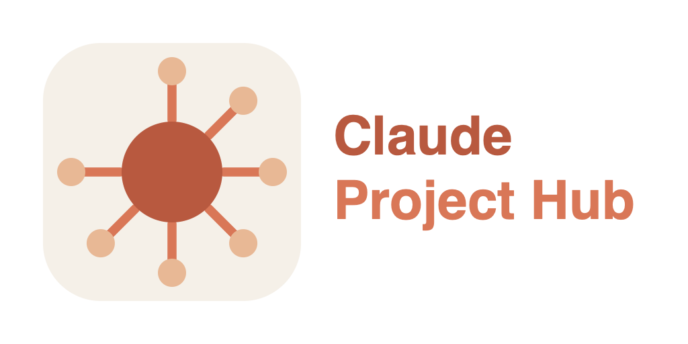

# Claude Project Hub

<p align="center">
  
</p>

[](https://github.com/dasien/ClaudeProjectHub/actions/workflows/build.yml)

A native macOS app that gives you one place to manage Claude Code sessions across whichever terminal or IDE launches them. Discover, focus, close, and resume sessions — without reinventing the terminal.

## Why

Claude sessions can be from a variety of hosts.  Tracking these sessions and identifying when the Claude is waiting for the user to provide input, is a growing issue.  The project hub solves this by allowing the user to create new sessions or 'adopt' existing ones into a single place.

## Features

- **Unified session list** across every supported terminal and IDE
- **Launch / Focus / Close / Resume** sessions from one place; status detection (idle / working / closed) reads from `~/.claude/sessions/<pid>.json` directly
- **Tab docking** — pin foreign host windows into the hub's tab area so multiple sessions live in one window with native-feeling tabs
- **Idle session notifications** when a session transitions from working → idle and the hub isn't already focused the user receives a system notification that Claude is waiting
- **Reattach on restart** — sessions whose underlying `claude` PID is still alive are re-bound and re-docked when the hub launches
- **External session adoption** — any `claude` running on the machine, including ones launched outside the hub, appears in the sidebar and can be docked
- **Resume past conversations** — closed conversations the hub never launched are discovered from `~/.claude/projects/` and listed under "Available to Resume"; pick a host and the hub runs `claude --resume` for you. Entries you'll never revisit can be hidden individually or per-project
- **Per-session cost + token breakdown** via right-click → Get Info; pricing comes from a user-editable `models.json`
- **Sessions Dashboard** (⌘⇧D) — one table of every session on the machine, hub-tracked or not, with cost and token totals
- **Survives the messy cases** — sleep/wake, monitor plug/unplug, and closing the lid in clamshell mode all re-pin docked windows instead of losing them. If you resume a conversation yourself in a terminal, the hub notices and adopts it
- **Stays in sync with you** — bring a docked host window to the front yourself (click it, ⌘-tab, Mission Control) and the hub's selection follows, without stealing focus back
- **Keyboard**: ⌘⇧F focuses the selected session's window, ⌘1–9 switch tabs, ⌘⇧D opens the dashboard, ⌘, opens Settings

## Supported hosts

Pre-configured. The New Session picker filters to whichever of these you actually have installed:

- **Terminal.app**
- **iTerm2**
- **JetBrains IDEs**: IntelliJ IDEA, PyCharm, WebStorm, PhpStorm, RubyMine, CLion, GoLand, Rider, Android Studio
- **Visual Studio Code** — one caveat: on the **first** launch into a folder VSCode hasn't seen before, it shows its "Do you trust the authors of the files in this folder?" prompt. That prompt is drawn *inside* the window rather than as a separate one, so the hub can't tell it apart from a loaded workspace and its keystrokes land on the dialog instead of a terminal. If a VSCode session launch appears to do nothing, accept the trust prompt in VSCode and launch the session again. Subsequent launches into that folder work normally. See [Common quirks](USER_GUIDE.md#common-quirks).

Adding a host the hub doesn't ship with (Ghostty, WezTerm, kitty, …) is a no-code change — see [Adding a host](#adding-a-host) below.

## Development Requirements

- macOS 14+ (developed against macOS 26)
- Xcode 26+ — the only version this has been built with, and what CI uses. Older Xcodes may work but are untested; the previous "16+" claim was never verified.
- [xcodegen](https://github.com/yonaskolb/XcodeGen) — `brew install xcodegen`

## Install

There's no downloadable binary. Each developer builds and signs their own
copy — which sounds like a limitation but is the right model for this app:
macOS ties Accessibility and Automation grants to the code signature, so a
copy **you** signed keeps its permissions across rebuilds. A binary signed
by someone else would need notarisation (a paid Apple Developer membership)
and would still have to ask for its own grants anyway.

```bash
git clone git@github.com:dasien/ClaudeProjectHub.git
cd ClaudeProjectHub
brew install xcodegen                          # one-time
cp signing.xcconfig.example signing.xcconfig   # one-time per checkout
$EDITOR signing.xcconfig                       # add your Team ID (see below)
./install.sh
```

`install.sh` checks your prerequisites, builds Release, verifies the
signature and entitlements, and installs to `/Applications`. Then launch it
and right-click its Dock icon → **Options → Keep in Dock**. Re-run the
script any time to update your installed copy; your granted permissions
persist because the signature doesn't change.

```bash
./install.sh --prefix ~/Applications   # no admin rights needed
./install.sh --no-open                 # don't launch afterwards
./install.sh --help
```

On first launch you'll be asked for **Accessibility** (to focus, move and
close host windows) and then **Automation** once per host the first time
you target it. Both are required — see [Permissions on first launch](USER_GUIDE.md#permissions-on-first-launch) for what each one is for and how to unstick them.

## Build (for working on the app)

To develop rather than just install, open the project in Xcode and run from
there:

```bash
xcodegen                        # regenerate .xcodeproj from project.yml
open ClaudeProjectHub.xcodeproj
```

Note that an Xcode-run debug build and an installed `/Applications` copy are
separate apps as far as macOS permissions are concerned, so each asks for
its own grants.

`signing.xcconfig` is per-developer and gitignored. Your Team ID is in **Xcode → Settings → Accounts → your Apple ID → the "Team ID" column**, or from the command line as the `OU` field of your certificate:

```bash
security find-certificate -c "Apple Development" -p | openssl x509 -noout -subject
# subject=UID=…, CN=Apple Development: you@example.com (AAAAAAAAAA), OU=BBBBBBBBBB, …
#                                                                      ^^^^^^^^^^ Team ID
```

> **Don't use the parenthesised string from `security find-identity`.** On an *Apple Development* certificate that's a certificate identifier, not the Team ID, and building with it fails with `No Account for Team "…"`. It only happens to be the Team ID on a *Developer ID Application* certificate, which is what makes this an easy mistake.

Two things that will bite you if you do these out of order:

- **`xcodegen` fails outright if `signing.xcconfig` doesn't exist** (`invalid config file path`), so copy the example before generating — as in the commands above.
- **Fill in the real team ID *before* running `xcodegen`, or run it again afterwards.** `xcodegen` bakes `DEVELOPMENT_TEAM` into the generated `.xcodeproj`, so if you generate while the file still says `YOUR_TEAM_ID`, Xcode keeps failing with *"No Account for Team"* even after you fix the xcconfig. Re-run `xcodegen`, then close and reopen the project so Xcode rereads it.

Use a real team rather than ad-hoc signing (`-`): TCC ties Accessibility and Automation grants to the code signature, so ad-hoc builds get re-signed each time and lose their permissions on every rebuild.

Run the project from Xcode. The first launch prompts for **Accessibility** access; the first time each host (Terminal, iTerm2, …) is targeted, macOS will also prompt for **Automation/Apple Events** access for that specific app. Both prompts are necessary for the hub to bind, focus, and close host windows.

`.xcodeproj/` is gitignored — it's regenerated from `project.yml`. Re-run `xcodegen` whenever you add or remove files in `Sources/`.

## Releasing

`project.yml` is the single source of truth for the version — `Info.plist`
interpolates `$(MARKETING_VERSION)` and `$(CURRENT_PROJECT_VERSION)`, so the
built app always matches what's declared there.

```bash
./install.sh --bump minor    # major | minor | patch | an explicit 1.2.3
```

That rewrites both settings in `project.yml`, then builds and installs as
usual so you can verify the result before committing anything. It
deliberately does **not** commit or tag — it prints the commands instead:

```bash
git add project.yml
git commit -m "Release v0.9.0"
git tag -a v0.9.0 -m "v0.9.0"
git push && git push --tags
```

Conventions worth keeping:

- **`MARKETING_VERSION`** (`0.9.0`) is the user-facing version. Bump the
  minor for anything you'd describe to a user, the patch for fixes.
- **`CURRENT_PROJECT_VERSION`** is a monotonic build counter — `--bump`
  always increments it, and it should never go backwards.
- **Tag every release** `vX.Y.Z`. There's no other record of what shipped
  when, since there are no release artefacts to point at.

Pre-`1.0` while three things are outstanding: there's no notarised build
(so it can't be handed to a non-developer — see [Install](#install)), the
Xcode host isn't implemented, and the app has only been exercised on the
author's machine.

## Project layout

```
Sources/
├── App/                  @main app + scenes + environment objects
├── Models/               Session, HostConfig, SessionStatus, WindowMode,
│                         DockState, HistoricalSession, ModelPricing,
│                         SessionUsage, ...
├── Stores/               SessionStore (persistence), HostRegistry,
│                         DismissedHistoricalStore (hidden resume entries)
├── Services/             AXSupport, AXObserver, AXWriteTracker,
│                         AppleScriptRunner, ClaudeSessionFile,
│                         ClaudeSessionTranscript, ModelPricingRegistry,
│                         SessionLauncherService, SessionLifecycleMonitor,
│                         WindowManager, DockController, HostWindowResolver,
│                         HostTabSelector, ExternalSessionScanner,
│                         HistoricalSessionScanner, AttentionService,
│                         SessionCatalog, HubMouseGate, ProcessTree, ...
├── Launchers/            ScriptedHostLauncher (single launcher; every
│                         host's behavior lives in its .applescript)
└── UI/                   SwiftUI views — sidebar, tabs, dialogs, settings,
                          per-session info, sessions dashboard, host editor
Resources/
├── Info.plist            (generated by xcodegen)
├── ClaudeProjectHub.entitlements
├── models.json           Claude pricing data (per-1M-token rates)
├── Scripts/              Bundled .applescript launch scripts (one per host)
└── Assets.xcassets/      App icon
logos/                    Brand assets — SVG sources, exported PNGs, export script
project.yml               xcodegen config (source of truth for the .xcodeproj)
```

## Adding a host

Each host is driven by an AppleScript file. The hub substitutes a known set of placeholders (`{cwd}`, `{claude}`, `{bundleID}`, `{marker}`, `{mode}`, `{targetWindowID}`) into the script before running it.

The fast path:

1. Open **Settings → Hosts** (⌘,) → **+** to add a host
2. Pick the app, enter a display name. The hub auto-slugs an id and copies `_template.applescript` into `~/Library/Application Support/ClaudeProjectHub/scripts/<your-id>.applescript`
3. Edit the script to fit how your host accepts a command. The bundled scripts in `Resources/Scripts/` cover the common patterns: CLI-spawnable terminals, IDEs driven by a keyboard shortcut, IDEs driven by a menu walk

The full integration walkthrough — placeholder contract, return-value contract, AX-diff fallback for window discovery, and the lessons baked into the existing scripts — is in [`INTEGRATIONS_GUIDE.md`](INTEGRATIONS_GUIDE.md).

## Docs

- [`USER_GUIDE.md`](USER_GUIDE.md) — end-user flows: permissions, session lifecycle, docking, Get Info, notifications, Settings, where files live on disk, known quirks
- [`INTEGRATIONS_GUIDE.md`](INTEGRATIONS_GUIDE.md) — adding a host: the placeholder + return-value contracts, three worked patterns, testing checklist
- [`CLAUDE.md`](CLAUDE.md) — architecture, design decisions, hard-won gotchas, milestone state

## Contributing

Read [`CLAUDE.md`](CLAUDE.md) first — it captures the design decisions, the gotchas we've already hit, and the current milestone state. Claude Code auto-loads that file when you open a session in this repo, so your AI collaborator will have the same context you do.

Its "Lessons learned" section is worth reading before touching the AX layer specifically — several non-obvious behaviours (spurious destroy notifications during sleep/wake, CGWindowIDs changing across wake, the AX server transiently returning an application element where a window is expected) cost real debugging time to pin down and are documented so they don't have to be rediscovered.

## License

To be decided.
